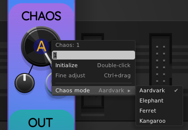
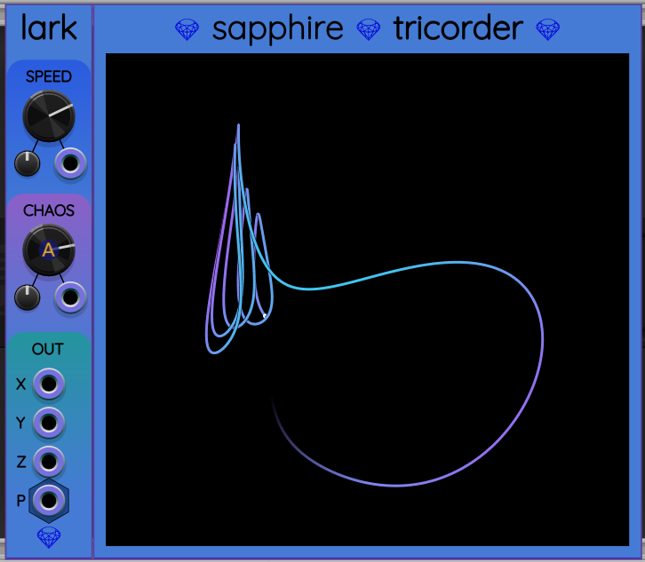

## Lark

Lark is a low frequency (and ultra-low frequency) chaotic oscillator.

### Mathematical basis

Lark is based on the [Dequan Li attractor](http://www.3d-meier.de/tut19/Seite9.html),
a system of three differential equations

$$
\frac{\mathrm{d}x}{\mathrm{d}t} = A (y - x) + D x z
$$

$$
\frac{\mathrm{d}y}{\mathrm{d}t} = K x + F y - x z
$$

$$
\frac{\mathrm{d}z}{\mathrm{d}t} = C z + x y - E x^2
$$

The right sides of these equations are all functions
of $x$, $y$, and $z$. The left sides are all rates of change
of these variables with time.

The equations above convert the current location
of a particle into a velocity vector that points in the direction
the particle must move. No matter where the particle is, Lark calculates
its velocity vector and uses it to update the particle's position vector.

See the following paper for a more in-depth analysis of the Dequan Li attractor's dynamics:

*  "[Poincar&eacute; sections for a new three-dimensional
toroidal attractor](https://www.physics.drexel.edu/~bob/Papers/Torochaos.pdf)" by Letellier and Gilmore.

### Outputs

The outputs are available in two different forms, for convenience:

1. Three separate monophonic output ports for X, Y, and Z respectively.
   These ports support [voltage flipping](VoltageFlipping.md).
2. A polyphonic port P that represents the vector (X, Y, Z) using 3 channels.

### Knobs

**SPEED**: This knob allows varying how fast the simulation runs.
The default speed is 0, but speed may be set anywhere
from &minus;7 to +7. Each unit on this knob's scale represents a factor
of 2. That means when you change SPEED from 0 to +3, it will be $2^3=8$
times faster. Thus the speed can made $2^7=128$ times slower than the default
by turning the SPEED knob all the way to the left, or 128 times faster than
the default by turning it all the way to the right.

However, at the risk of using a **LOT** more CPU time, you can right-click
on the SPEED knob and toggle "Turbo Mode", which adds a +5 bonus to the SPEED value.
This is the same as multiplying the effective speed by 32.

**CHAOS**: This knob controls the value of a constant in the Dequan Li attractor in a way that varies the nature of its chaotic orbit.

Lark supports 4 distinct *chaos modes* that are named after types of animals.
Each animal name starts with the same letter as the Dequan Li parameter being controlled:

* Aardvark for $A$.
* Elephant for $E$.
* Ferret for $F$.
* Kangaroo for $K$.

You can change the chaos mode by right-clicking on the CHAOS knob and selecting one of the chaos mode options:

Both Turbo Mode and Chaos Mode are also available in the right-click menu of the Lark panel.

### CV input
The SPEED and CHOAS knobs have associated attenuverters and CV input ports.
Both can be operated over the full knob range using a wide enough attenuverter setting.

### Graphing with Tricorder

[Tricorder](Tricorder.md) is a 3D oscilloscope designed for compatibility with Lark.
If you place a Lark immediately to the left of a Tricorder, Lark
will start to feed data into Tricorder, which will plot a 3D graph:

