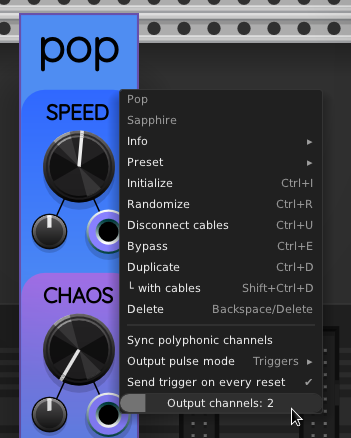

## Pop

Sapphire Pop is a polyphonic trigger generator that can simulate the statistical
behavior of radioactive decay, or generate completely regular pulses,
or anywhere on a spectrum between these extremes.

## Output channel count

By right-clicking on Pop's panel, you will see a slider that allows you
to select a number of channels in the range 1..16. By default, Pop outputs
a pulse trigger that has a single channel. By changing this slider setting,
you can tell Pop to output up to 16 polyphonic channels from the PULSE port.
This results in up to 16 independent pulse generators.

## SPEED control group

The SPEED knob ranges from &minus;7 to +7. The default value is 0, which results
in a mean pulse rate of 2&nbsp;Hz. This frequency was chosen to match
the default frequency of the [VCV LFO](https://library.vcvrack.com/Fundamental/LFO).

Each time you increase the SPEED by 1, it doubles the mean pulse frequency.
In other words, just like a V/OCT input, every volt represents an octave.
Therefore, you can increase the speed by a factor of $2^7=128$ by turning the SPEED
knob all the way to +7. This results in a mean pulse rate of 256&nbsp;Hz.
If you turn SPEED all the way down to &minus;7, the effective frequency is $2^{-6}=\frac{1}{64}$ Hz,
resulting in less than one pulse per minute on average.

## CHAOS control group

When the CHAOS knob is turned all the way to 1 (its maximum value),
Pop produces output pulses with completely random timing, using
[Poisson distribution](https://en.wikipedia.org/wiki/Poisson_distribution)
statistics for radioactive decay.

When CHAOS is set to its minimum value of 0, the pulses occur as exactly fixed intervals
based on the SPEED control.

Intermediate values of CHAOS perform a linear interpolation between completely regular
timing and completely random timing.

## SYNC trigger input

When a cable is connected to the SYNC input port, a trigger received on that
port causes all 1..16 polyphonic Pop engines to restart in sync.
This can be useful for CHAOS set to 0 or a very small value, to bring
all the output PULSE channels to a common starting point.

## PULSE trigger output

PULSE is a polyphonic trigger output. Most of the time, each channel voltage is zero.
When a pulse occurs on channel, the voltage immediately jumps to 10&nbsp;V and stays
there for one millisecond. Then the voltage goes back to 0&nbsp;V for another millisecond.

After that, a pulse can occur again at any time. This results in a maximum possible
instantaneous pulse rate of 500&nbsp;Hz, even though the mean pulse rate is clamped to 256&nbsp;Hz.
