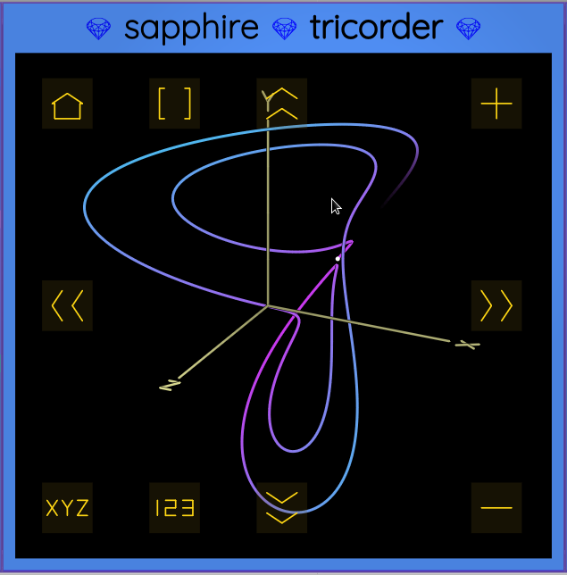

## Tricorder

Tricorder is a 3D oscilloscope designed for displaying
animations of a triplet of low-frequency voltages.

Tricorder was designed specifically as an expander module
for [Frolic](Frolic.md), but it also allows graphing
any three input voltages you want, using [Tin](Tin.md)
instead of Frolic to the left of Tricorder.

In general, Tricorder is useful for visually understanding the behavior
of Frolic or any other 3D system of voltages.
Tricorder also could be a fun decoration for your patch.

The photo at the top is an example of Frolic placed to the immediate
left side of Tricorder, which causes them to "connect".
When connected, Frolic sends its (X, Y, Z) outputs
into Tricorder for graphing.

Here is an example of using [Tin](Tin.md) instead:

Three different sine waves are fed through Tin into Tricorder
to be graphed. The result is a 3D [Lissajous curve](https://en.wikipedia.org/wiki/Lissajous_curve).

### Controls

Once you have connected Tricorder to a signal source (by attaching either Frolic or Tin to its left side),
it will start graphing the signal. If you hover the mouse pointer over the display area, a group of controls
will appear:

* The double-chevron symbols (&gt;&gt;) at the left, right, top, and bottom sides of the display
allow rotating the animation in four different directions.
* The XYZ button toggles whether coordinate axes are shown.
* The 123 button toggles whether the voltage values are displayed as numbers at the bottom of the display.
* The + and &minus; buttons zoom in and out.
* The home button in the upper left corner resets the default orientation and zoom level.

You can also click anywhere in the middle of the display, hold down the left mouse button,
and drag to reorient the display. This stops any automatic rotation that was in progress.
If you want to restart rotation, click one of the double-chevron buttons.

## Sample videos

Here is a video that explains all the controls in more detail:

And here is another video without talking, just showing me play around with Frolic and Tricorder:

