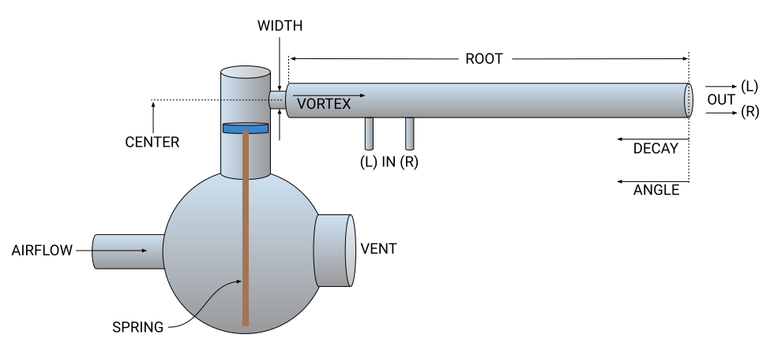

## Tube Unit

Tube Unit is a stereo effect synthesizer based on waveguide resonance.
It can generate sounds on its own, or act as a filter to process input audio.

### Demo videos

### Physics model

Tube Unit is loosely based on a physical acoustics model of a resonant tube,
but with some fanciful departures from real-world physics to make it more fun.
The following schematic will be helpful for understanding and using Tube Unit.

### Control groups

* **AIRFLOW**
* **VORTEX**
* **WIDTH**
* **CENTER**
* **DECAY**
* **ANGLE**
* **ROOT**
* **SPRING**

### Other inputs

* **VENT**
* **L** and **R** audio inputs

### Output level (OUT)

The knob at the bottom right marked OUT adjusts the volume level of the
stereo output signal. It controls the polyphonic outputs of the output
ports in the lower right corner labeled **L** and **R**.

### Context menu

Tube Unit's context menu looks like this:

It includes options for controlling a built-in output limiter,
as described below.

### Output limiter

Tube Unit's physical model can produce a wide range of output voltage levels.
The amplitude can be hard to predict, so as a safeguard,
Tube Unit includes an output limiter that uses automatic gain control
to keep the output voltages within a reasonable range.

The limiter can be enabled or disabled. When enabled,
it can be set to any threshold level between 5V and 10V.
When the limiter is enabled, it will adapt automatically
to output voltages higher than its threshold by quickly
reducing output gain. If the volume gets quieter than
the level setting, the limiter allows the gain to settle
back to a maximum of unity gain (0 dB).
This means the limiter never makes the output louder
than it would be if the limiter were disabled.

By default, the limiter is enabled and is configured
for an 8.5V threshold.
Using Tube Unit's right-click context menu, you can slide
the limiter threshold left or right anywhere from 5V to 10V.

If you move the slider all the way to the right, it will
turn the limiter OFF.
Disabling the limiter like this can result in extreme output voltages in
some cases, but it could make sense for patches where Tube Unit's output
is controlled by some external module, such as a mixer with a very low setting.
Most of the time, it's a good idea to leave the limiter enabled,
to avoid extremely loud sounds and clipping distortion.

### Limiter distortion warning light

When Tube Unit's limiter is enabled, and the output
level is so high that the limiter is actively working
to keep it under control, the sound quality will not
be ideal. Therefore, Tube Unit signals a warning by
making the output level knob glow red, like this:

This is a hint that you might want to turn down the
output knob a little bit, or do something else to
make Tube Unit quieter, in order to eliminate any
distortion introduced by the limiter.
Of course, you are the judge of sound quality, and you
may decide to ignore the limiter warning if you are
getting good results in your patch.

If you disable the limiter, this is interpreted as a
manual override, and the warning light will not turn on.

If you don't want the warning light to come on, but you
want to keep the limiter enabled, there is an option
for this in the right-click context menu labeled
*Limiter warning light*. Clicking on this option
will toggle whether the warning light turns on
when the limiter is active. The warning light option
defaults to being enabled.
